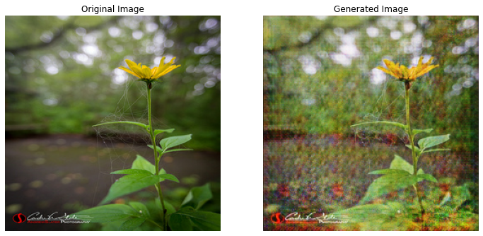
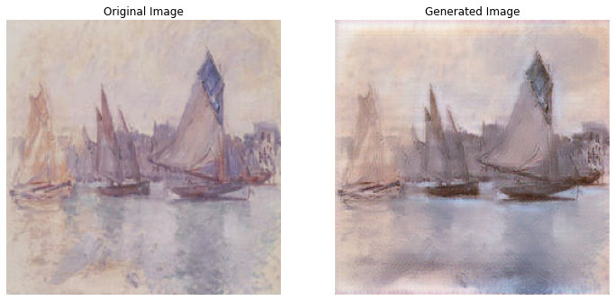

# GAN to create Monet-style arts
# CycleGAN results after 10 Epochs
[Google Colab Link](https://colab.research.google.com/drive/1nQ4KUd5pRFpZU3Us3X_kfiYzn77zs1Up?usp=sharing)
## Before Training

## After Training

## Photo to Monet 

## Monet to photo

